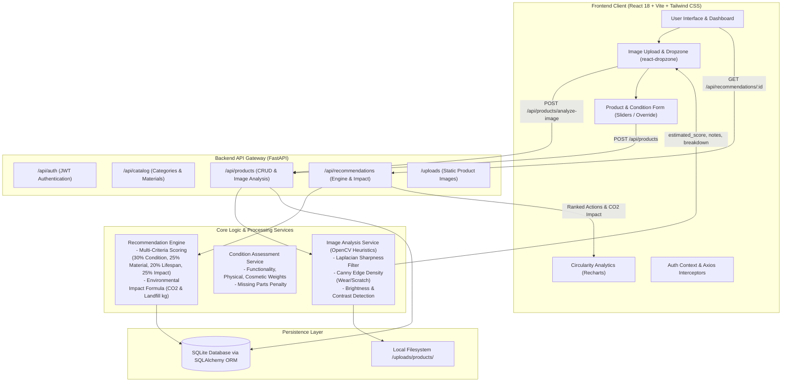
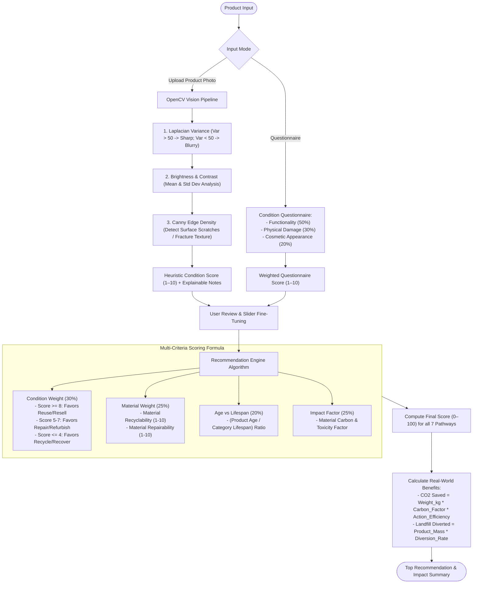
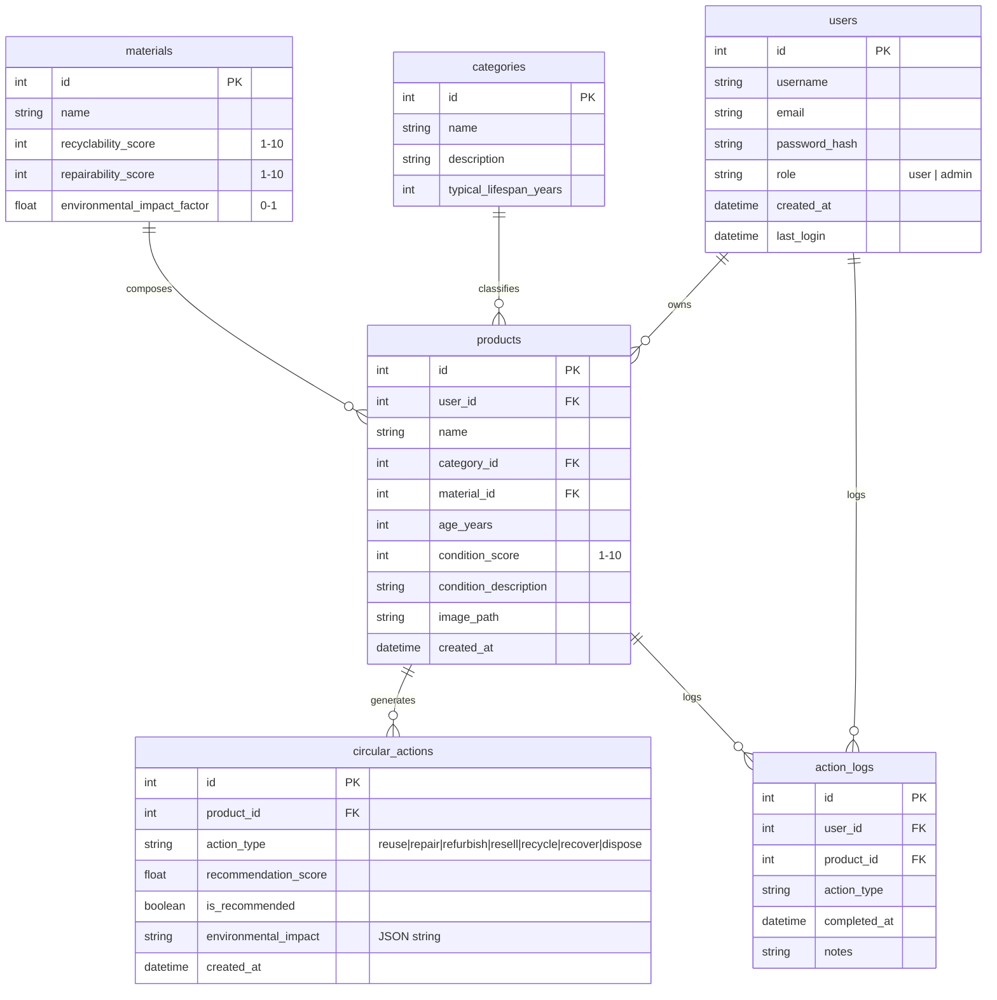

# Circular Economy Recommendation Engine
## Capstone Project | Team INNOVATEX

[](https://sdgs.un.org/goals/goal12)
[](https://fastapi.tiangolo.com/)
[](https://opencv.org/)
[](https://vitejs.dev/)
[](https://tailwindcss.com/)
[](https://www.sqlite.org/)

---

## 🌍 Why This Project? (The Problem & Solution)

### The Problem: The Linear "Take-Make-Dispose" Economy
Modern consumption follows a linear throughput model where products are extracted, manufactured, used briefly, and discarded into landfills or incinerators. This causes:
* **Severe Resource Depletion & E-Waste:** Millions of tons of electronics, metals, and plastics are discarded prematurely while still having significant functional or material value.
* **Lack of Decision Support:** Consumers, asset managers, and recyclers lack objective, accessible tools to answer: *"Is this item best suited for reuse, repair, refurbishment, component recovery, or recycling?"*
* **Subjective / Inaccurate Condition Assessment:** Estimating wear and tear is often guesswork, leading to under-utilization and unnecessary disposal.

### How This Project Solves It
The **Circular Economy Recommendation Engine** provides an end-to-end, intelligent decision-support system aligned with **UN Sustainable Development Goal 12 (Responsible Consumption & Production)**:
1. **Automated Vision-Based Assessment:** Users can upload a photo of their product. An OpenCV-powered computer vision pipeline analyzes surface wear, scratches, edge density, and sharpness to estimate a condition score (1–10).
2. **User-in-the-Loop Fine-Tuning:** Users can review the auto-detected score, inspect explainable confidence notes, and adjust sliders or questionnaire parameters.
3. **Multi-Criteria Circular Optimization:** A multi-factor mathematical scoring engine ranks all 7 circular pathways (*Reuse, Repair, Refurbish, Remanufacture, Resell, Recycle, Recover*).
4. **Quantified Environmental Impact:** For every action, the engine calculates real-world impact metrics: **$CO_2$ emissions avoided (kg)** and **landfill waste diverted (kg)**.

---

## 🏗️ System Architecture & Data Flow



---

## 🧠 How the Core Logics Work



---

## 🛠️ Technology Stack

### Backend
* **Language & Runtime:** Python 3.10+
* **Web Framework:** FastAPI & Uvicorn (ASGI)
* **Computer Vision:** OpenCV (`opencv-python`) & Pillow (`PIL`)
* **Database & ORM:** SQLite with SQLAlchemy 2.0
* **Authentication:** JWT (JSON Web Tokens) with `python-jose` and `passlib[bcrypt]`
* **Validation & Settings:** Pydantic v2 & `pydantic-settings`

### Frontend
* **Core:** React 18 with Vite
* **File Uploads:** `react-dropzone`
* **Routing:** React Router v7
* **Styling:** Tailwind CSS with custom eco-friendly palette
* **Charts & Analytics:** Recharts
* **HTTP Client:** Axios (with request/response auth interceptors)

---

## 📁 Directory Structure

```text
circular-economy/
├── backend/
│   ├── app/
│   │   ├── __init__.py
│   │   ├── auth.py                  # JWT creation, password hashing & auth dependencies
│   │   ├── config.py                # Centralized settings & environment loader
│   │   ├── database.py              # SQLAlchemy engine, session & Base model setup
│   │   ├── main.py                  # FastAPI app entrypoint, static uploads & routers
│   │   ├── models.py                # Database models (User, Product, Category, Material, etc.)
│   │   ├── schemas.py               # Pydantic validation schemas
│   │   ├── routers/
│   │   │   ├── __init__.py
│   │   │   ├── admin.py             # Admin management endpoints
│   │   │   ├── auth.py              # Registration, login & current user endpoints
│   │   │   ├── catalog.py           # Category & material listings
│   │   │   ├── products.py          # Product CRUD, image analysis endpoint
│   │   │   └── recommendations.py   # Circular recommendation endpoints
│   │   └── services/
│   │       ├── __init__.py
│   │       ├── image_analysis.py    # OpenCV blur, brightness, contrast & edge wear analyzer
│   │       ├── condition_assessment.py # Weighted condition questionnaire logic
│   │       └── recommendation_engine.py # Multi-criteria circular scoring algorithm
│   ├── uploads/products/            # Storage directory for uploaded product photos
│   ├── init_db.py                   # Database initializer & initial seed data script
│   └── requirements.txt             # Python dependency manifest
├── frontend/
│   ├── public/
│   ├── src/
│   │   ├── components/
│   │   │   ├── auth/                # LoginForm, RegisterForm
│   │   │   ├── common/              # Navbar, LoadingSpinner, ProtectedRoute
│   │   │   ├── dashboard/           # SummaryCards, ImpactChart
│   │   │   ├── products/            # ProductList, ProductCard, ProductForm, ImageUpload
│   │   │   └── recommendations/     # RecommendationList, RecommendationCard
│   │   ├── context/                 # AuthContext state management
│   │   ├── pages/                   # Dashboard, Products, ProductDetail, Login, Register
│   │   ├── services/                # Axios API client & service wrappers
│   │   ├── App.jsx                  # Root router & layout configuration
│   │   ├── index.css                # Tailwind styles & theme variables
│   │   └── main.jsx                 # React application entrypoint
│   ├── package.json                 # Node.js dependencies & scripts
│   ├── postcss.config.js
│   ├── tailwind.config.js           # Custom Tailwind theme tokens
│   └── vite.config.js               # Vite development configuration
├── .env.example                     # Example environment variables template
├── .gitignore                       # Repository ignore rules
└── README.md                        # Project documentation
```

---

## 💾 Database Schema



---

## 🚀 Setup & Execution Guide

### Prerequisites
* **Python 3.10+** and `pip`
* **Node.js 18+** and `npm`

---

### 1. Backend Setup

1. **Navigate to the backend directory**:
   ```bash
   cd backend
   ```

2. **Create and activate a virtual environment**:
   ```bash
   python3 -m venv venv

   # macOS / Linux
   source venv/bin/activate

   # Windows (cmd)
   venv\Scripts\activate.bat
   ```

3. **Install Python dependencies**:
   ```bash
   pip install -r requirements.txt
   ```

4. **Configure environment variables**:
   ```bash
   cp ../.env.example .env
   ```

5. **Initialize and seed the database**:
   ```bash
   python init_db.py
   ```
   *Creates standard categories, materials, and a default admin user.*

6. **Start the FastAPI backend server**:
   ```bash
   uvicorn app.main:app --reload --port 8000
   ```
   * Interactive API docs: [http://localhost:8000/docs](http://localhost:8000/docs)
   * Alternative ReDoc: [http://localhost:8000/redoc](http://localhost:8000/redoc)

---

### 2. Frontend Setup

1. **Navigate to the frontend directory**:
   ```bash
   cd frontend
   ```

2. **Install Node dependencies**:
   ```bash
   npm install
   ```

3. **Start the Vite development server**:
   ```bash
   npm run dev
   ```
   * The web application will be accessible at: [http://localhost:5173](http://localhost:5173)

---

## 🔑 Default Credentials

| Role | Username | Password |
| :--- | :--- | :--- |
| **Admin** | `admin` | `admin123` |

*(You can also register new regular user accounts via the frontend registration page at `/register`)*

---

## 🗓️ Development Roadmap

* [x] **Phase 1: Project Setup & Backend Foundation**
  * FastAPI architecture, SQLite & SQLAlchemy models, JWT auth flow.
* [x] **Phase 2: Product & Material Management**
  * Category and material catalog, product CRUD endpoints, condition assessment service.
* [x] **Phase 3: Recommendation Engine Implementation**
  * Weighted multi-criteria scoring algorithm, circular action generation, and carbon/landfill impact calculation.
* [x] **Phase 4: Frontend Development**
  * React + Vite application, Tailwind custom UI, circularity dashboard with Recharts, interactive condition assessment form, and recommendation viewer.
* [x] **Phase 5: Image-Based Condition Auto-Detection (OpenCV)**
  * Drag-and-drop image upload (`react-dropzone`), OpenCV heuristic analysis (blur variance, brightness/contrast, edge density for surface wear), user slider fine-tuning, and image display on cards and detail views.

