# Circular Economy Recommendation Engine
## Capstone Project | Team INNOVATEX

[](https://sdgs.un.org/goals/goal12)
[](https://fastapi.tiangolo.com/)
[](https://vitejs.dev/)
[](https://tailwindcss.com/)
[](https://www.sqlite.org/)

---

## 📌 Project Overview
* **Project Name:** Circular Economy Recommendation Engine
* **Team:** INNOVATEX (Avi Mathur, Dev Sharma, Rohit Bhatia)
* **Scrum ID:** PRJ26-27/F-07
* **Primary SDG:** SDG 12 – Responsible Consumption and Production
* **Scope:** An intelligent full-stack decision-support system designed to assess products, calculate condition scores via structured assessment criteria, and recommend optimal circular economy pathways (Reuse, Repair, Refurbish, Resell, Recycle, Recover, or Dispose) to minimize waste and carbon footprint.

---

## 🛠️ Technology Stack

### Backend
* **Language & Runtime:** Python 3.10+
* **Web Framework:** FastAPI & Uvicorn
* **Database & ORM:** SQLite with SQLAlchemy 2.0
* **Authentication:** JWT (JSON Web Tokens) with `python-jose` and `passlib[bcrypt]`
* **Validation & Settings:** Pydantic v2 & `pydantic-settings`

### Frontend
* **Core:** React 18 with Vite
* **Routing:** React Router v7
* **Styling:** Tailwind CSS with custom eco-friendly palette
* **Charts & Analytics:** Recharts
* **HTTP Client:** Axios (with request/response auth interceptors)

---

## 📁 Directory Structure

```text
circular-economy/
├── backend/
│   ├── app/
│   │   ├── __init__.py
│   │   ├── auth.py          # JWT creation, password hashing & auth dependencies
│   │   ├── config.py        # Centralized settings & environment loader
│   │   ├── database.py      # SQLAlchemy engine, session & Base model setup
│   │   ├── main.py          # FastAPI app entrypoint, routers, & CORS config
│   │   ├── models.py        # Database models (User, Product, Category, Material, etc.)
│   │   ├── schemas.py       # Pydantic validation schemas
│   │   ├── routers/
│   │   │   ├── __init__.py
│   │   │   ├── admin.py     # Admin management endpoints
│   │   │   ├── auth.py      # Registration, login & current user endpoints
│   │   │   ├── catalog.py   # Category & material listings
│   │   │   ├── products.py  # Product CRUD & condition assessment
│   │   │   └── recommendations.py # Circular recommendation endpoints
│   │   └── services/
│   │       ├── __init__.py
│   │       ├── condition_assessment.py # Condition questionnaire & scoring engine
│   │       └── recommendation_engine.py # Weighted multi-criteria circular scorer
│   ├── init_db.py           # Database initializer & initial seed data script
│   └── requirements.txt     # Python dependency manifest
├── frontend/
│   ├── public/
│   ├── src/
│   │   ├── components/
│   │   │   ├── auth/        # LoginForm, RegisterForm
│   │   │   ├── common/      # Navbar, LoadingSpinner, ProtectedRoute
│   │   │   ├── dashboard/   # SummaryCards, ImpactChart
│   │   │   ├── products/    # ProductList, ProductCard, ProductForm
│   │   │   └── recommendations/ # RecommendationList, RecommendationCard
│   │   ├── context/         # AuthContext state management
│   │   ├── pages/           # Dashboard, Products, ProductDetail, Login, Register
│   │   ├── services/        # Axios API client & service wrappers
│   │   ├── App.jsx          # Root router & layout configuration
│   │   ├── index.css        # Tailwind styles & theme variables
│   │   └── main.jsx         # React application entrypoint
│   ├── package.json         # Node.js dependencies & scripts
│   ├── postcss.config.js
│   ├── tailwind.config.js   # Custom Tailwind theme tokens
│   └── vite.config.js       # Vite development configuration
├── .env.example             # Example environment variables template
├── .gitignore               # Repository ignore rules
└── README.md                # Project documentation
```

---

## 💾 Database Schema

```mermaid
erDiagram
    users ||--o{ products : owns
    users ||--o{ action_logs : logs
    categories ||--o{ products : classifies
    materials ||--o{ products : composes
    products ||--o{ circular_actions : generates
    products ||--o{ action_logs : logs

    users {
        int id PK
        string username
        string email
        string password_hash
        string role "user | admin"
        datetime created_at
        datetime last_login
    }

    categories {
        int id PK
        string name
        string description
        int typical_lifespan_years
    }

    materials {
        int id PK
        string name
        int recyclability_score "1-10"
        int repairability_score "1-10"
        float environmental_impact_factor "0-1"
    }

    products {
        int id PK
        int user_id FK
        string name
        int category_id FK
        int material_id FK
        int age_years
        int condition_score "1-10"
        string condition_description
        datetime created_at
    }

    circular_actions {
        int id PK
        int product_id FK
        string action_type "reuse|repair|refurbish|resell|recycle|recover|dispose"
        float recommendation_score
        boolean is_recommended
        string environmental_impact "JSON string"
        datetime created_at
    }

    action_logs {
        int id PK
        int user_id FK
        int product_id FK
        string action_type
        datetime completed_at
        string notes
    }
```



---

## ⚙️ Recommendation & Scoring Logic

The recommendation engine scores and ranks each circular action path using four weighted factors:

1. **Condition Score (30% weight):** Assesses the physical and functional state (1–10). High scores favor direct **Reuse** or **Resell**; moderate scores suggest **Repair** or **Refurbish**; low scores prioritize **Recycle** or **Recover**.
2. **Material Properties (25% weight):** Evaluates constituent material recyclability and repairability scores (1–10).
3. **Age vs. Lifespan (20% weight):** Compares the product's current age against the category baseline lifespan.
4. **Environmental Impact (25% weight):** Computes estimated $CO_2$ emissions avoided (kg) and landfill diversion (kg) based on material impact factors and action type.

---

## 🚀 Setup & Execution Guide

### Prerequisites
* **Python 3.10+** and `pip`
* **Node.js 18+** and `npm`

---

### 1. Backend Setup

1. **Navigate to the backend directory**:
   ```bash
   cd backend
   ```

2. **Create and activate a virtual environment**:
   ```bash
   python3 -m venv venv

   # macOS / Linux
   source venv/bin/activate

   # Windows (cmd)
   venv\Scripts\activate.bat
   ```

3. **Install Python dependencies**:
   ```bash
   pip install -r requirements.txt
   ```

4. **Configure environment variables**:
   ```bash
   cp ../.env.example .env
   ```

5. **Initialize and seed the database**:
   ```bash
   python init_db.py
   ```
   *Creates standard categories, materials, and a default admin user.*

6. **Start the FastAPI backend server**:
   ```bash
   uvicorn app.main:app --reload --port 8000
   ```
   * Interactive API docs: [http://localhost:8000/docs](http://localhost:8000/docs)
   * Alternative ReDoc: [http://localhost:8000/redoc](http://localhost:8000/redoc)

---

### 2. Frontend Setup

1. **Navigate to the frontend directory**:
   ```bash
   cd frontend
   ```

2. **Install Node dependencies**:
   ```bash
   npm install
   ```

3. **Start the Vite development server**:
   ```bash
   npm run dev
   ```
   * The web application will be accessible at: [http://localhost:5173](http://localhost:5173)

---

## 🔑 Default Credentials

| Role | Username | Password |
| :--- | :--- | :--- |
| **Admin** | `admin` | `admin123` |

*(You can also register new regular user accounts via the frontend registration page at `/register`)*

---

## 🗓️ Development Roadmap

* [x] **Phase 1: Project Setup & Backend Foundation**
  * FastAPI architecture, SQLite & SQLAlchemy models, JWT auth flow.
* [x] **Phase 2: Product & Material Management**
  * Category and material catalog, product CRUD endpoints, condition assessment service.
* [x] **Phase 3: Recommendation Engine Implementation**
  * Weighted multi-criteria scoring algorithm, circular action generation and impact calculation.
* [x] **Phase 4: Frontend Development**
  * React + Vite application, Tailwind custom UI, circularity dashboard with Recharts, interactive condition assessment form, and recommendation viewer.
* [x] **Phase 5: Full-Stack Integration & Polish**
  * End-to-end API connectivity, robust CORS handling, responsive navigation, authentication guards.
