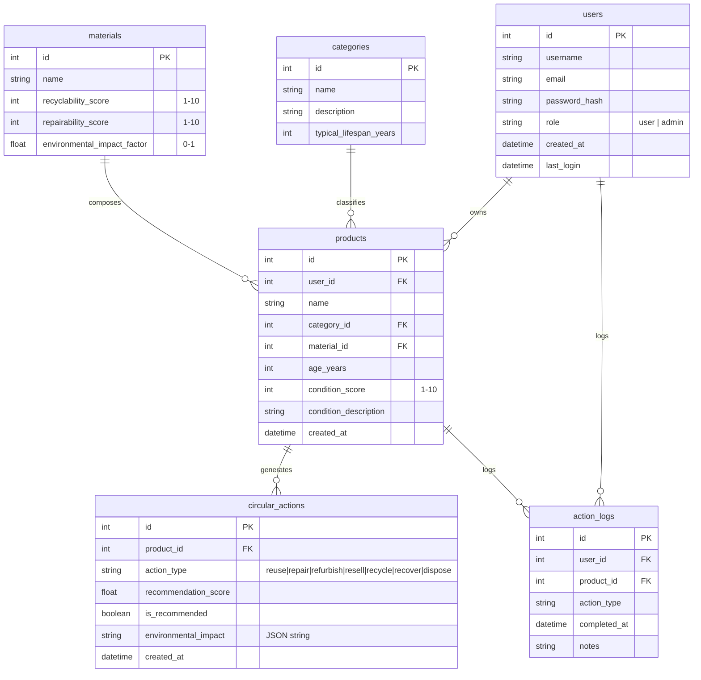

# Circular Economy Recommendation Engine
## Capstone Project | Team INNOVATEX

[](https://sdgs.un.org/goals/goal12)
[](https://fastapi.tiangolo.com/)
[](https://www.sqlite.org/)

---

## 📌 Project Identity
*   **Project Name:** Circular Economy Recommendation Engine
*   **Team:** INNOVATEX (Avi Mathur, Dev Sharma, Rohit Bhatia)
*   **Scrum ID:** PRJ26-27/F-07
*   **Primary SDG:** SDG 12 – Responsible Consumption and Production
*   **Scope:** An intelligent decision-support system designed to assess products, calculate their condition scores, and recommend optimal circular actions (such as Reuse, Repair, Refurbish, Resell, Recycle, or Recover) to minimize waste and carbon footprint.

---

## 🛠️ Technology Stack
*   **Backend:** Python 3.13+, FastAPI, Uvicorn
*   **Database:** SQLite (development database) with SQLAlchemy ORM
*   **Authentication:** JWT (JSON Web Tokens) with `python-jose` and `passlib[bcrypt]`
*   **Frontend (Planned):** React.js (Vite), Tailwind CSS, Recharts for data visualization

---

## 📁 Directory Structure
```text
backend/
├── app/
│   ├── __init__.py
│   ├── auth.py          # JWT & password hashing utilities
│   ├── config.py        # Pydantic-based settings management
│   ├── database.py      # SQLAlchemy engine and session setup
│   ├── main.py          # FastAPI application entrypoint and CORS setup
│   ├── models.py        # SQLAlchemy database models
│   ├── schemas.py       # Pydantic schemas for data validation
│   └── routers/
│       ├── __init__.py
│       └── auth.py      # Authentication routes (login, register)
├── .env.example         # Example configuration file
├── .env                 # Environment variables (local dev)
├── circular_economy.db  # SQLite database instance (generated)
├── init_db.py           # Database initializer and seed script
├── requirements.txt     # Python dependency manifest
└── README.md            # Project documentation
```

---

## 💾 Database Schema

The database is built on SQLite using SQLAlchemy ORM. Below is the relational schema:



---

## ⚙️ Recommendation & Scoring Logic

The core recommendation engine relies on a weighted multi-criteria scoring algorithm. The score for each circular action type is determined using four major factors:

1.  **Condition Score ($30\%$ weight):** Reflects the physical state ($1$–$10$) of the product. High scores favor Reuse/Resell; lower scores suggest Repair/Refurbish or Recycle.
2.  **Material Properties ($25\%$ weight):** Determined by the material's recyclability and repairability index ($1$–$10$).
3.  **Age vs. Lifespan ($20\%$ weight):** Evaluates the product's current age against its category's typical lifespan.
4.  **Environmental Impact ($25\%$ weight):** Factors in the environmental impact index of the constituent materials, scaled by the chosen circular path to minimize CO2 emissions and landfill volume.

---

## 🚀 Setup & Execution Instructions

Follow these steps to run the backend locally:

### 1. Prerequisite Checks
Ensure Python 3.10+ and `pip` are installed on your system.

### 2. Set Up a Virtual Environment
Create and activate a virtual environment to manage dependencies:
```bash
# Create a virtual environment
python3 -m venv venv

# Activate on macOS/Linux:
source venv/bin/activate

# Activate on Windows (cmd):
venv\Scripts\activate.bat
```

### 3. Install Dependencies
Install all required packages:
```bash
pip install -r requirements.txt
```

### 4. Configure Environment Variables
Copy the template configuration file:
```bash
cp .env.example .env
```
Open `.env` and configure your settings:
*   `DATABASE_URL`: SQLite database file path.
*   `JWT_SECRET_KEY`: A secure random secret key.
*   `JWT_ALGORITHM`: Cryptographic algorithm (default: `HS256`).

### 5. Initialize & Seed Database
Set up the tables and populate seed data (default categories, materials, and a default admin user):
```bash
python init_db.py
```
*Note: This creates a default admin account with username `admin` and password `admin123`.*

### 6. Run the FastAPI Development Server
Start the Uvicorn server:
```bash
uvicorn app.main:app --reload --port 8000
```
The interactive API documentation will be available at:
*   **Swagger UI:** [http://127.0.0.1:8000/docs](http://127.0.0.1:8000/docs)
*   **ReDoc:** [http://127.0.0.1:8000/redoc](http://127.0.0.1:8000/redoc)

---

## 🗓️ Development Roadmap

*   **Phase 1: Project Setup & Backend Foundation** (Status: **Completed**)
    *   FastAPI application structure initialized.
    *   SQLite database with SQLAlchemy schemas designed and operational.
    *   User authentication endpoints (register, login, JWT issuance) implemented.
*   **Phase 2: Product & Material Management** (Status: **Next**)
    *   Create endpoints for Category and Material management.
    *   Create CRUD endpoints for user Products.
    *   Implement Assessment questionnaire schemas.
*   **Phase 3: Recommendation Engine Implementation**
    *   Code the weighted multi-criteria scoring algorithm.
    *   Create `/recommendations/generate` endpoints.
*   **Phase 4: Frontend Development**
    *   React setup using Vite + Tailwind CSS.
    *   Develop dashboard, entry forms, and impact visualizations using Recharts.
*   **Phase 5: Integration, Polish & Deploy**
    *   End-to-end API integration and validation.
    *   Performance optimizations and UI styling polish.
